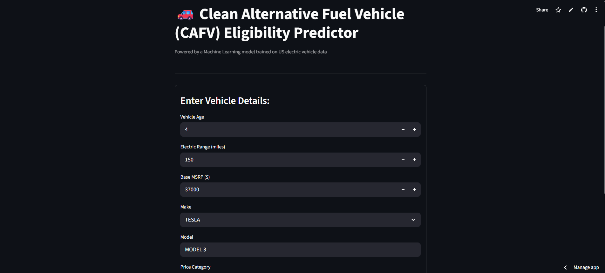

# 🚗 Clean Alternative Fuel Vehicle (CAFV) Eligibility Predictor

This project is a **Machine Learning-powered web app** that predicts whether an electric vehicle is **eligible for Clean Alternative Fuel Vehicle (CAFV) incentives** based on its specifications.

Built using:
- `scikit-learn` (modeling + pipeline)
- `Streamlit` (frontend app)
- Real-world data from the [U.S. Government Open Data Catalog](https://catalog.data.gov/dataset/electric-vehicle-population-data)

---

## 📊 Demo

👉 **Live App:** [Link](https://cafv-eligibility-predictor-2025.streamlit.app/)



---

## 🔍 Features

- Predicts **CAFV eligibility** based on:
  - Vehicle age
  - Electric range
  - MSRP
  - Make, model, price category
  - Electric vehicle type (BEV or PHEV)
- Real-time predictions with Streamlit UI
- Preprocessing + model pipeline with scikit-learn
- Interactive form-based input
- Easy to deploy and scale

---

## 🧠 Machine Learning Pipeline

- **Target Variable:**  
  `Clean Alternative Fuel Vehicle (CAFV) Eligibility`  
  Encoded as 1 (Eligible) or 0 (Not Eligible)

- **Features Used:**  
  - Vehicle Age  
  - Electric Range  
  - Base MSRP  
  - Make (Top 10 + "Other")  
  - Model  
  - Price Category (Low/Mid/High/Luxury)  
  - EV Type (BEV / PHEV)

- **Model:**  
  `RandomForestClassifier` with a preprocessing pipeline

---

## 🛠 How to Run Locally

### 1. Clone the Repo

```bash
git clone https://github.com/your-username/ev-cafv-streamlit.git
cd ev-cafv-streamlit
